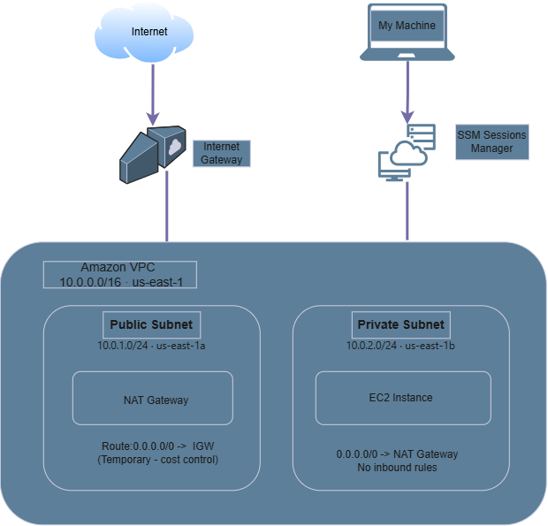

VPC with Public/Private Subnet Isolation

## What this is
A VPC built to understand the core pattern behind most production cloud 
networks: separating what's exposed to the internet from what isn't, 
enforced through routing rather than naming or convention.

## Architecture diagram

## Resources created
| Resource | ID | Purpose |
|---|---|---|
| VPC | vpc-00f047b684c04f7de | Isolated network, 10.0.0.0/16 |
| Public subnet | subnet-0b4f506745a89011b | 10.0.1.0/24, us-east-1a |
| Private subnet | *(fill in)* | 10.0.2.0/24, us-east-1b |
| Internet Gateway | *(fill in)* | Internet access for public subnet |
| Public route table | *(fill in)* | Routes 0.0.0.0/0 → IGW, associated with public subnet |
| NAT Gateway | *(in progress)* | Outbound internet for private subnet |
| IAM role (SSM) | *(in progress)* | Lets SSM manage the instance, no SSH needed |
| EC2 instance | *(in progress)* | Launched in private subnet, managed via SSM |

## Design decisions
- Split subnets across two Availability Zones (us-east-1a / us-east-1b) 
  so a single data-center outage doesn't take down both.
- Isolation is enforced by the route table, not a setting — the private 
  subnet simply has no route to the internet gateway.

## Design evolution
Originally planned with a bastion host in the public subnet, SSH access 
restricted to a single IP via security group. This proved impractical 
since my IP changes across locations. Pivoted to AWS Systems Manager (SSM) 
Session Manager: the instance moves into the private subnet with no 
inbound rules at all, and access is authenticated through IAM instead of 
network location. A key pair (bastion-key) and SSH-based security group 
(bastion-sg) were created during the original approach and remain as a 
record of this decision, but are not part of the final architecture.

## How to reproduce it
*(AWS CLI commands to be added once complete)*

## Teardown
*(to be added)*
